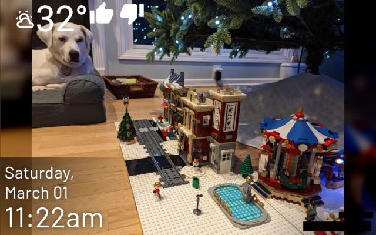
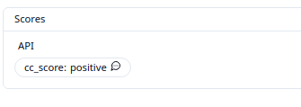

# Conversation Rating for ViewAssist Devices

This use case implements automated conversation rating prompting on ViewAssist devices, allowing users to provide feedback on conversation quality directly through their ViewAssist display.

## Overview

```mermaid
flowchart TD
   A[Conversation with Assistant] --> B[Conversation Ends]
   B --> C[Automation Triggered]
   C --> D[Rating Prompt Displayed on ViewAssist]
   D --> |User rates| E[User Rates Conversation]
   D --> |Timeout| F[Rating Icons Removed]
   E --> G[Rating Icons Removed]
   G --> H[Rating Sent to Langfuse]
   H --> I[Analytics Available in Langfuse Dashboard]
   F --> J[No Rating Recorded]
```

When a user interacts with a voice assistant through a ViewAssist device, this implementation automatically prompts them for feedback after the conversation ends. The user can rate the conversation directly on the ViewAssist display, and the rating is sent to Langfuse for analytics and improvement tracking.

## Prerequisites

- Home Assistant with Custom Conversation integration properly configured
- [ViewAssist](https://dinki.github.io/View-Assist/) set up and working
- Langfuse integration enabled in Custom Conversation with tracing and scoring enabled
- Assist Satellite devices (ie, Wyoming Satellites or ESPHome Assist devices) - other implementations may not be properly captured by the Conversation entity as the originating Device.

## Implementation

This implementation uses:

1. An **automation blueprint** that listens for conversation end events and triggers the rating prompt
2. A **script blueprint** that displays the rating options on the ViewAssist device and handles the user's selection

### Files Included

- `conversation_rating_automation.yaml`: Blueprint for the automation that triggers after conversations
- `conversation_rating_script.yaml`: Blueprint for the script that displays rating options and processes selections
- `viewassist_dashboard_config.yaml`: Configuration snippets for the ViewAssist dashboard to handle rating button actions

## Setup Instructions

### 1. Import the Blueprints

In Home Assistant:

1. Click here to import the conversation rating automation:

   

2. Click here to import the conversation rating script:

   

### 2. Create the Automation

1. Go to **Settings** → **Automations & Scenes** → **Automations**
2. Click **+ Add Automation**
4. Choose the **ViewAssist Conversation Rating Prompt** blueprint
5. Configure the required parameters:
   - ViewAssist Satellites Group: Select your group containing ViewAssist satellite devices
   - Optional: Adjust the icon display time

### 3. Create the Script

1. Go to **Settings** → **Automations & Scenes** → **Scripts**
2. Click **+ Add Script**
3. Select **Create script from blueprint**
4. Choose the **ViewAssist Conversation Rating Script** blueprint
5. Configure the required parameters:
   - Custom Conversation Config Entry: Select your Custom Conversation integration
   - Processing Delay: How long to wait before sending the score to Langfuse. If this period is too short, the trace may not be recorded by Langfuse by the time we try to score it, so the score won't be recorded. If the period is too long and the user issues another request from the same device, there's a risk of scoring the wrong conversation. The default of 3 seconds seems to work well in my testing, but you can change it if your environment requires.

### 4. Update ViewAssist Dashboard

1. Open your ViewAssist dashboard configuration
2. Add the configuration snippets from [viewassist_dashboard_config.md](viewassist_dashboard_config.md) to your dashboard:
   - Add the `var_mic_device` variable to your variables section
   - Add the `thumbs_up` and `thumbs_down` templates to your icon templates section

## How It Works

1. When a conversation ends with a ViewAssist device, the automation is triggered
2. The script displays rating options on the ViewAssist device
3. The user can tap on either the positive or negative rating
4. The rating is sent to Langfuse using the Custom Conversation scoring service
5. The rating appears in your Langfuse dashboard, associated with the specific conversation

Example dashboard with thumbs up/down after a user request:

## Viewing the Results

Ratings are sent to Langfuse and can be viewed in the Langfuse dashboard:

1. Log in to your Langfuse account
2. Navigate to the **Scores** section
3. Filter by the `cc_score` score name to see all conversation ratings

They also appear at the bottom of each trace:

